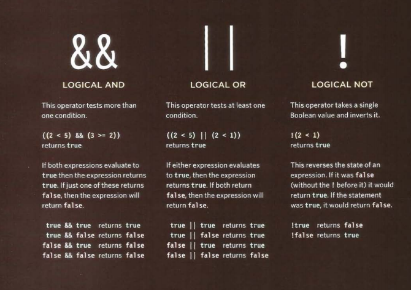
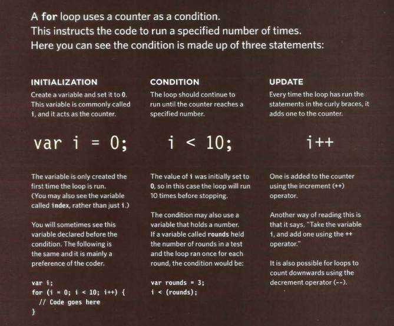

# Comparison operators: evaluating conditions

You can evaluate a situation by comparing one value in the script to what you expect it might be. The result will be Boolean: true or false.

1. Is equal to (= =): this operator compares two values numbers, string or Boolean. To see if they are the same.

2. Is not equal to (! =): this operator compares two values numbers, string or Boolean. To see if they are not the same.

3. Strict equal to (= = =): this operator compares two values to check that both the data type and value are the same.

4. Strict not equal to (! = =): this operator compares two values to check that both the data type and value are not the same.

5. Greater than (>): this operator checks if the number on the left is greater than the number on the right.

6. Less than (<): this operator checks if the number on the left is less than the number on the right.

7. Greater than or equal to (> =): this operator checks if the number on the left is greater than or equal the number on the right.

8. Less than or equal to (< =): this operator checks if the number on the left is less than or equal the number on the right.

## Logical operators

Logical operators allow you to compare the results of more than one comparison operator.

## Loops

Loops check a condition if it returns true, a code block will run. Then the condition will be checked again and if it still returns true the code block will run again.it repeats until the condition returns false.

### Common types of loops

1. **For**: if you need to run a code for a specific number of times then use **for loop**.

2. **While**: if you don’t know how many times the code should run, you can use a **while loop**.

3. **Do while**: it’s similar to the **while loop**, but it has one difference it will always run the statement inside the curly braces.

### Loop counters

